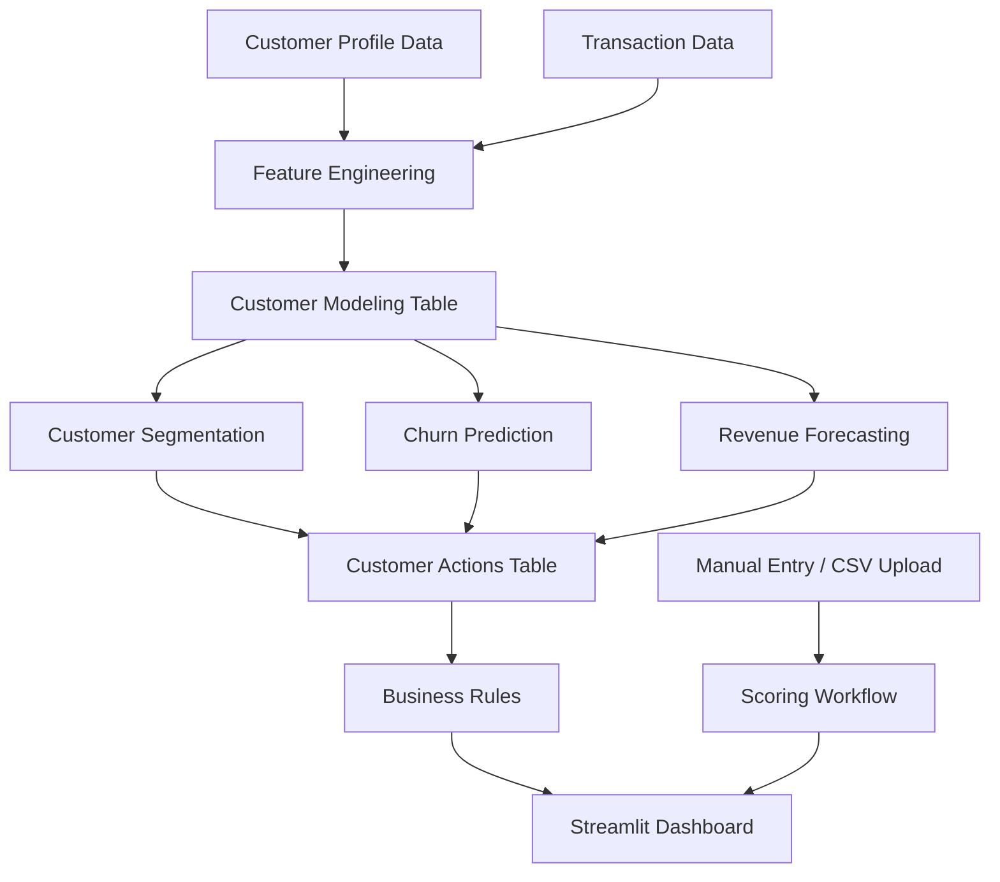

# Customer Intelligence Platform

> Predict churn, optimize retention, and maximize revenue with an AI-powered customer analytics dashboard.


Customer Intelligence Platform is a premium Streamlit analytics application that helps businesses understand customer behavior, forecast revenue, identify churn risk, and prioritize retention actions. The project combines a modern enterprise SaaS-style interface with a modular Python analytics backend and an end-to-end customer scoring workflow.

## Preview

The application is designed to feel like a polished enterprise analytics product:

- Dark AI SaaS interface
- Executive KPI cards
- Customer segmentation insights
- Churn and revenue-at-risk monitoring
- Retention action recommendations
- Manual and CSV-based customer scoring
- Business rule configuration for risk thresholds and CRM actions

## What It Does

Customer Intelligence Platform helps revenue, retention, and growth teams turn customer data into action. It generates or scores customer-level features, segments customers by behavior, predicts churn probability, forecasts next-month spend, and recommends business actions based on configurable risk thresholds.

Supported workflows:

- Explore demo customer intelligence data
- Filter customers by country, segment, risk, age, and predicted spend
- Review revenue-at-risk breakdowns
- Prioritize high-risk customers for retention action
- Score a single custom customer profile
- Upload company CSV data and map columns to the model feature contract
- Download scored customer results for CRM or growth operations

## Core Features

| Area | Feature |
| --- | --- |
| UI/UX | Premium Streamlit interface with dark theme, executive layout, styled metrics, and decision-focused sections |
| Segmentation | KMeans-based customer segments using behavioral and transaction-level features |
| Churn | Churn probability scoring with configurable low, medium, and high-risk thresholds |
| Revenue | Next-month spend prediction and revenue-at-risk prioritization |
| Actions | CRM-ready recommendations such as nurture, engagement campaign, and retention offer review |
| Data Upload | CSV upload scoring with company column mapping |
| Reliability | Cached pipeline execution, modular code organization, validation, and Streamlit-native KPI rendering |
| Deployment | Ready for Streamlit Community Cloud from the root `app.py` entrypoint |

## Architecture



## Project Structure

```text
customer-intelligence-platform/
├── app.py                         # Streamlit UI, dashboard layout, filters, scoring workflows
├── run_pipeline.py                # CLI runner for the analytics pipeline
├── requirements.txt               # Runtime dependencies
├── CASE_STUDY_DS.ipynb            # Original case-study notebook
├── README.md                      # Project documentation
└── src/
    └── customer_analytics/
        ├── __init__.py
        ├── config.py              # Shared configuration, feature lists, sample sizes
        ├── data_generation.py     # Synthetic customer and transaction data generation
        ├── evaluation.py          # Classification and regression metrics
        ├── features.py            # Customer-level feature engineering
        ├── modeling.py            # Churn and spend model training
        ├── pipeline.py            # End-to-end orchestration and scored actions
        └── segmentation.py        # Customer segmentation workflow
```

## Execution Flow

1. Streamlit starts from `app.py`.
2. The app loads custom CSS, the hero section, sidebar control panel, and dashboard tabs.
3. `load_pipeline_data()` runs the cached analytics pipeline.
4. `run_pipeline()` generates customer data, transaction data, features, segments, churn scores, spend forecasts, and recommended actions.
5. Business rules apply configurable risk thresholds and action labels.
6. Sidebar filters narrow the customer population.
7. Dashboard tabs render executive KPIs, risk distribution, revenue-at-risk breakdowns, segment views, customer tables, scoring workflows, and model diagnostics.
8. Users can manually score a customer profile or upload CSV data for bulk scoring.

## Getting Started

### 1. Clone the repository

```bash
git clone https://github.com/MOHAMMED-GHANIM-SIDDIQUI/customer-intelligence-platform.git
cd customer-intelligence-platform
```

### 2. Create a virtual environment

```bash
python -m venv .venv
```

Activate it:

```bash
# Windows
.venv\Scripts\activate

# macOS / Linux
source .venv/bin/activate
```

### 3. Install dependencies

```bash
pip install -r requirements.txt
```

### 4. Run the app

```bash
python -m streamlit run app.py
```

The app will open locally at:

```text
http://localhost:8501
```

## Run the Pipeline

To execute the analytics pipeline from the command line:

```bash
python run_pipeline.py
```

This prints:

- segment profile
- churn model metrics
- spend forecast metrics
- sample customer actions

## Deployment on Streamlit Community Cloud

This repository is ready to deploy on Streamlit Community Cloud.

Use these deployment settings:

| Setting | Value |
| --- | --- |
| Repository | `MOHAMMED-GHANIM-SIDDIQUI/customer-intelligence-platform` |
| Branch | `master` |
| Main file path | `app.py` |
| Dependency file | `requirements.txt` |

Deploy from:

https://share.streamlit.io

## Data Notes

The current project uses synthetic case-study data to demonstrate the product workflow. In a production environment, the same interface should be connected to company systems such as:

- CRM/customer profile tables
- orders and payment systems
- subscription or lifecycle data
- web/app analytics
- marketing engagement tables
- support or customer success history

For stronger production accuracy, future versions can add:

- model retraining on real churn labels
- calibrated churn probability thresholds
- customer lifetime value modeling
- automated data quality checks
- CRM integration for action export
- monitoring for drift and model performance

## Production Readiness Checklist

- Modular code structure
- Cached Streamlit pipeline execution
- Premium enterprise dashboard UI
- Business rule controls
- Customer filtering and exploration
- Manual scoring workflow
- CSV upload scoring workflow
- Data contract for company onboarding
- GitHub-ready README
- Streamlit Cloud deployment settings
- Automated tests
- CI checks
- Model monitoring
- Production retraining pipeline

## Tech Stack

- Python
- Streamlit
- pandas
- NumPy
- scikit-learn
- Matplotlib
- Seaborn

## Author

Built by Mohammed Ghanim Siddiqui.

## Acknowledgement

This project was rebuilt from a customer analytics case-study notebook into a cleaner, modular, enterprise-ready Streamlit application with a modern AI SaaS-style user experience.

## About

AI-powered customer intelligence dashboard for segmentation, churn prediction, revenue forecasting, and retention action planning.
